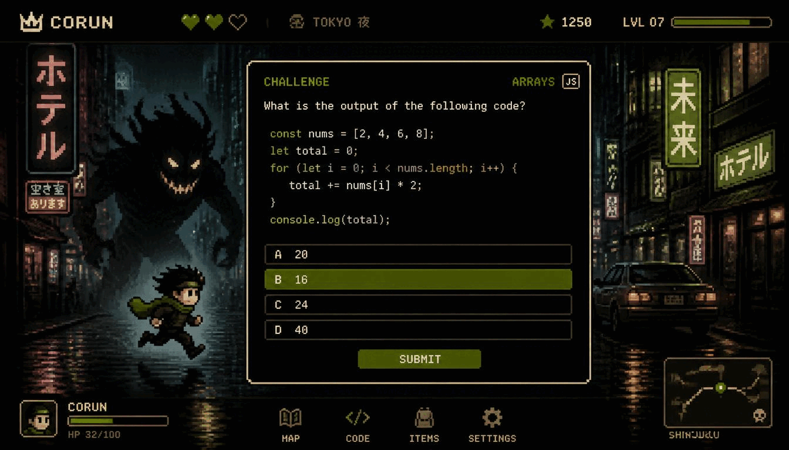

<div align="center">

# 🏃 CORUN

### Learn JavaScript by Escaping a Monster.

A modern pixel-art coding adventure where every challenge determines whether you survive.

<p>
  <a href="https://corun-zeta.vercel.app">🎮 Play Demo</a> •
  <a href="#quick-start">⚡ Quick Start</a> •
  <a href="#roadmap">🛣 Roadmap</a>
</p>



<br>


</div>

---

# 🎮 Why CORUN?

Most coding platforms feel like homework.

**CORUN turns programming into survival.**

Every JavaScript challenge changes the gameplay.

Answer correctly.

Escape.

Answer incorrectly...

The monster gets closer.

Whether you're solving algorithms in Story Mode or surviving endless waves in Arcade Mode, every decision matters.

---

# ✨ Features

## 📖 Story Mode

Explore handcrafted pixel worlds while learning JavaScript.

- 🌲 9 handcrafted levels
- 👥 Interactive NPCs
- 💬 Animated cutscenes
- 💻 Real JavaScript puzzles
- 🚪 Unlock new areas by solving code
- 👑 Final boss battle

---

## 🏃 Endless Runner

A fast-paced arcade mode where coding is your weapon.

- 👾 Monster chase mechanics
- ⚡ Adaptive difficulty
- 🔥 Combo multipliers
- 🏆 Boss battles
- 🎯 Daily challenges
- 🥇 Leaderboards

---

## 💻 Learn While Playing

Practice real programming concepts.

- Variables
- Conditions
- Loops
- Arrays
- Objects
- Functions
- Recursion
- Algorithms
- Debugging
- Output prediction

No fake coding.

No drag-and-drop blocks.

Real JavaScript.

---

# 📸 Gameplay

## Story Mode

Walk through a handcrafted pixel world.

Talk with NPCs.

Discover secrets.

Solve puzzles.

Unlock the next area.

> *(Insert Story Mode Screenshot Here)*

---

## JavaScript Challenges

Real coding questions appear throughout your adventure.

```js
function double(arr) {
  return arr.map(x => x * 2)
}
```

Correct answers unlock doors.

Wrong answers cost you time.

> *(Insert Coding Challenge Screenshot Here)*

---

## Endless Runner

Run.

Dodge.

Think.

Code.

Survive.

> *(Insert Endless Runner Screenshot Here)*

---

# ⚡ Core Gameplay Loop

```text
Explore
     ↓
Meet NPCs
     ↓
Receive Challenge
     ↓
Write JavaScript
     ↓
Pass
     ↓
Continue Adventure

        OR

Fail
     ↓
Monster Gets Closer
```

---

# 🚀 Quick Start

Clone the repository

```bash
git clone https://github.com/alimaandev/corun.git
cd corun
```

Install dependencies

```bash
npm install
```

Configure Auth0

```bash
cp .env.example .env
```

Fill in

```env
VITE_AUTH0_DOMAIN=
VITE_AUTH0_CLIENT_ID=
```

Start the development server

```bash
npm run dev
```

Open

```
http://localhost:3000
```

You're ready to play.

---

# 🎯 Game Modes

| Mode | Description |
|------|-------------|
| 📖 Story | Narrative adventure with JavaScript puzzles |
| 🏃 Endless | Infinite runner with adaptive coding challenges |
| 🏆 Daily Challenge | Compete once per day |
| 👑 Boss Battles | High difficulty coding encounters |

---

# 🧠 Built With

- React
- TypeScript
- Vite
- HTML5 Canvas
- Auth0
- localStorage
- IndexedDB

---

# 📂 Project Preview

```text
src
├── game
├── components
├── pages
├── assets
├── hooks
└── utils
```

The full architecture is documented inside the source code to keep this README clean.
---

# 🛠 Tech Stack

CORUN is built with modern web technologies for speed, scalability, and an enjoyable development experience.

| Category | Technology |
|-----------|------------|
| **Frontend** | React 18 + TypeScript |
| **Build Tool** | Vite |
| **Rendering** | HTML5 Canvas |
| **Authentication** | Auth0 |
| **State Management** | React Hooks |
| **Storage** | localStorage + IndexedDB |
| **Deployment** | Vercel |

---

# 🧩 Project Structure

```text
src/
├── assets/                 # Images, sprites, sounds
├── components/             # Shared React components
├── game/                   # Game engine
│   ├── story/              # Story mode
│   ├── endless/            # Endless runner
│   ├── puzzles/            # JavaScript challenges
│   ├── bosses/             # Boss encounters
│   └── engine/             # Core gameplay logic
├── hooks/                  # Custom React hooks
├── pages/                  # Landing, Login, Game
├── utils/                  # Helper utilities
├── App.tsx
└── main.tsx
```

The repository is organized to keep gameplay logic separate from the UI, making it easy to extend with new worlds, mechanics, and challenges.

---

# 🌍 Deployment

Deploy your own copy in minutes.

### Vercel

[](https://vercel.com/new)

Set the following environment variables:

```env
VITE_AUTH0_DOMAIN=your-domain
VITE_AUTH0_CLIENT_ID=your-client-id
```

Build locally

```bash
npm run build
```

Preview production build

```bash
npm run preview
```

---

# 🚧 Upcoming Features

## Version 1.1

- Better animations
- More NPC interactions
- Improved mobile controls
- More JavaScript questions

---

## Version 1.2

- New environments
- Soundtrack overhaul
- Achievement system
- Save slots

---

## Version 2.0

- Multiplayer races
- Custom level editor
- Community challenges
- Daily events
- Steam release

---

# 💡 Why Open Source?

CORUN isn't just a game.

It's a project built for developers who love games and gamers who want to learn programming.

Whether you want to:

- Improve gameplay
- Add new levels
- Create monsters
- Design pixel art
- Write puzzles
- Optimize performance

You're welcome here.

---

# 🤝 Contributing

We'd love your help.

1. Fork the repository

```bash
git checkout -b feature/amazing-feature
```

2. Commit your changes

```bash
git commit -m "feat: add amazing feature"
```

3. Push

```bash
git push origin feature/amazing-feature
```

4. Open a Pull Request

Every contribution—big or small—is appreciated.

---

# 📝 Issue Ideas

Looking for something to work on?

- 🎨 New pixel worlds
- 👾 New monster AI
- 💻 JavaScript challenges
- 🌍 Language support
- 📱 Mobile improvements
- 🎵 Sound effects
- ⚡ Performance optimizations
- 🎮 Accessibility improvements

---

# ❤️ Support the Project

If CORUN made you smile, taught you something, or inspired you...

please consider giving the repository a ⭐.

It helps more developers discover the project and motivates future updates.

---

<div align="center">

# ⭐ Star the Repository

If you enjoy CORUN,

leave a ⭐ and share it with your friends.

Every star helps this project grow.

<br>

<a href="https://github.com/alimaandev/corun">

</a>

</div>

---

# 📜 License

Distributed under the **MIT License**.

You are free to use, modify, and distribute this project in accordance with the license terms.

See the **LICENSE** file for more information.

---

<div align="center">

## Built with ❤️ by **alimaandev**

### Learn JavaScript.

### Escape the Monster.

### Beat the Boss.

### Become a Better Developer.

<br>

**Happy Coding! 🚀**

</div>
