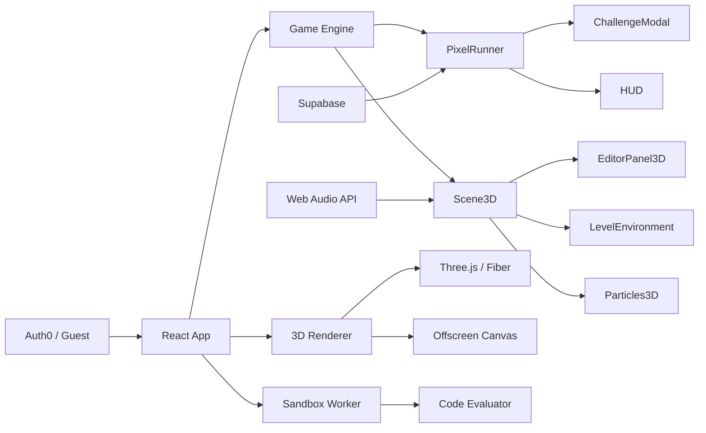

<p align="center">
  <picture>
    <source media="(prefers-color-scheme: dark)" srcset="public/icons/Corun.png">
    
  </picture>
</p>

<h1 align="center">CORUN</h1>
<h3 align="center">Escape the Monster — A 3D Pixel‑Art Coding Game</h3>

<p align="center">
  <em>Solve real JavaScript puzzles. Navigate 3D Tokyo streets. Outrun the monster. Master programming through play.</em>
</p>

<p align="center">
  <a href="https://corun-zeta.vercel.app">
    
  </a>
</p>

<p align="center">
  
</p>

<p align="center">
  <a href="https://github.com/alimaandev/corun/actions"></a>
  <a href="https://github.com/alimaandev/corun/blob/main/LICENSE"></a>
  <a href="https://github.com/alimaandev/corun"></a>
  <a href="https://github.com/alimaandev/corun/releases"></a>
</p>

<br />

---

## Quick Start

```bash
git clone https://github.com/alimaandev/corun.git
cd corun
npm install
npm run dev        # → http://localhost:3000
```

No Auth0 account needed — guest/demo mode works out of the box.

```bash
npm run typecheck  # tsc -b
npm run test       # vitest run (45+ tests)
npm run build      # tsc -b && vite build → dist/
```

> [Play the live game →](https://corun-zeta.vercel.app)

<br />

---

## Why Corun?

Most coding games are either **multiple-choice trivia** or **dry syntax drills**. Corun is neither.

```
You are trapped in a Tokyo cell.
A monster is breaking through the wall.
The only way out is to code.
```

- **Real JavaScript** — Write actual JS, not pseudo-code. Sandboxed Web Worker evaluation. 52 puzzles covering strings, arrays, objects, regex, math, logic, and ES6+.
- **3D story world** — 12 levels with diegetic code editors on 3D meshes, NPC patrols, particle effects, dynamic lighting. Walk through Shibuya, Asakusa, and the Imperial Palace.
- **Procedural soundtrack** — Every level has a unique Web Audio API composition. Zero audio files. BPM scales with your progress.
- **Works everywhere** — PWA installable on any device. Touch controls, offline support, 3 locales (EN/ES/FR).
- **Build your own puzzles** — Built-in puzzle editor. Share via URL. Browse community-created challenges.
- **470 KB gzipped** — Code-split chunks, lazy-loaded Three.js, offscreen canvas. Performance is a feature.

> *"Every line of code brought you home."*

<br />

---

## Features

<table>
  <tr>
    <td width="50%">
      <h4>🎮 <strong>Two Game Modes</strong></h4>
      <p>Story Mode (12-level 3D adventure) + Endless Runner (procedural arcade with adaptive difficulty).</p>
    </td>
    <td width="50%">
      <h4>📝 <strong>52 Real Code Puzzles</strong></h4>
      <p>JavaScript fundamentals — strings, arrays, objects, regex, math, logic, ES6+. Sandboxed evaluation.</p>
    </td>
  </tr>
  <tr>
    <td>
      <h4>🏰 <strong>3D Story World</strong></h4>
      <p>Diegetic code editor on 3D mesh, NPC patrols, particle burst effects, dynamic lighting, 12 unique scenes.</p>
    </td>
    <td>
      <h4>🎵 <strong>Procedural Soundtrack</strong></h4>
      <p>12 level-specific presets via Web Audio API. Reactive BPM scales with progress. Zero audio files.</p>
    </td>
  </tr>
  <tr>
    <td>
      <h4>📱 <strong>Mobile Ready</strong></h4>
      <p>Touch joystick, responsive UI, installable PWA. Works fully offline after first load.</p>
    </td>
    <td>
      <h4>🛠️ <strong>User-Generated Content</strong></h4>
      <p>Built-in puzzle editor, share via base64 URL, community puzzle browser. Create and play custom challenges.</p>
    </td>
  </tr>
  <tr>
    <td>
      <h4>🌐 <strong>i18n</strong></h4>
      <p>English, Spanish, French. Auto-detects browser locale. Persisted to localStorage.</p>
    </td>
    <td>
      <h4>🏆 <strong>Competitive Modes</strong></h4>
      <p>Speed Run (60s countdown) & Survival (3 lives) modes. Global Supabase leaderboard. Skill-based badges.</p>
    </td>
  </tr>
</table>

<br />

---

## Architecture


```mermaid
flowchart LR
  A[React App] --> B[Game Engine]
  A --> C[3D Renderer]
  A --> D[Sandbox Worker]
  B --> E[PixelRunner]
  B --> F[Scene3D]
  C --> G[Three.js / Fiber]
  C --> H[Offscreen Canvas]
  D --> I[Code Evaluator]
  E --> J[ChallengeModal]
  E --> K[HUD]
  F --> L[EditorPanel3D]
  F --> M[LevelEnvironment]
  F --> N[Particles3D]
  O[Auth0 / Guest] --> A
  P[Supabase] --> E
  Q[Web Audio API] --> F
```

<br />

---

## Game Modes

<details>
<summary><strong>🏰 Story Mode</strong> — 12 levels across 3 arcs</summary>

<br />

Walk a 3D side-scrolling world, interact with NPCs, solve code puzzles at glowing terminals, and follow a narrative through cutscenes.

| Level | Name | Arc | Theme |
|-------|------|-----|-------|
| 1 | The Cell | Awakening | `if` statements, guard patrol |
| 2 | The Dungeon | Deeper | Loops, array filtering |
| 3 | The Sewers | Into the Dark | String manipulation, recursion |
| 4 | The Forest | The Wilds | Object manipulation |
| 5 | The Village | Civilization | Sorting, comparison |
| 6 | The Bridge | Crossing | Math utilities, geometry |
| 7 | The Courtyard | Fortress | Stack/queue, validation |
| 8 | The Hall | The Castle | State machines |
| 9 | The Throne Room | The King | Combined + final boss |
| 10 | The Library | Archives | Array methods, indexOf |
| 11 | The Laboratory | Alchemy | String ops, sequences |
| 12 | The Tower Spire | The Summit | Advanced logic |

</details>

<details>
<summary><strong>🏃 Endless Runner</strong> — Procedural arcade mode</summary>

<br />

Classic 3-lane highway escape. Challenges pop up mid-run — answer fast or the monster closes in.

- **4 question types** — Multiple choice, fill-in-blank, output prediction, spot the bug
- **Adaptive difficulty** — 3 correct = harder, 2 wrong = easier
- **Combo multiplier** — 3+ streak → 1.5× up to 4× at 10+
- **Boss battles** — Every ~150 pts, hard questions, big rewards
- **Bonus rounds** — Every ~80 pts, 5-second lightning round, 2× points
- **Daily challenges** — One shot per day, leaderboard comparison
- **Mastery badges** — 5+ correct in a topic = badge

</details>

<details>
<summary><strong>⚡ Speed Run & ❤️ Survival</strong> — Competitive variants</summary>

<br />

| Mode | Rules |
|------|-------|
| **Speed Run** | 60-second countdown. Wrong answers cost points. Timer in HUD. |
| **Survival** | 3 lives. Every wrong answer loses one. Hearts displayed in HUD. |

</details>

<br />

---

## Tech Stack

| Category | Tools |
|----------|-------|
| **Frontend** | React 18, TypeScript, Vite 6, Three.js, @react-three/fiber |
| **Audio** | Web Audio API (procedural synthesis, zero audio files) |
| **Auth** | Auth0 (with automatic guest fallback) |
| **Database** | Supabase (leaderboard only) |
| **Testing** | Vitest, React Testing Library, jsdom |
| **CI/CD** | GitHub Actions, semantic-release, ESLint, Prettier |
| **PWA** | vite-plugin-pwa, Workbox, service worker caching |
| **Deploy** | Vercel (SPA with client-side routing) |

<br />

---

## Star History

<p align="center">
  <a href="https://star-history.com/#alimaandev/corun&Date">
    
  </a>
</p>

<p align="center">
  <a href="https://github.com/alimaandev/corun">
    
  </a>
  <a href="https://twitter.com/intent/tweet?text=🏃%20CORUN%20-%20Escape%20the%20Monster%20-%20A%20pixel-art%203D%20coding%20game.%20Solve%20JavaScript%20puzzles.%20Escape%20the%20monster.%20&url=https://github.com/alimaandev/corun">
    
  </a>
  <a href="https://news.ycombinator.com/submitlink?u=https://github.com/alimaandev/corun&t=CORUN%20-%20Escape%20the%20Monster">
    
  </a>
</p>

<br />

---

## Contributing

All contributions welcome — bug fixes, features, translations, docs.

- [Bug reports](https://github.com/alimaandev/corun/issues/new?labels=bug&template=bug_report.yml)
- [Feature requests](https://github.com/alimaandev/corun/issues/new?labels=enhancement&template=feature_request.yml)
- [Good first issues](https://github.com/alimaandev/corun/labels/good%20first%20issue)
- [Contributing guide](CONTRIBUTING.md)

<br />

---

## License

MIT © [Ali Sher](https://github.com/alimaandev)

<p align="center">
  <sub><em>"Every line of code brought you home."</em></sub>
  <br />
  <sub>Built with React · TypeScript · Three.js · Vite</sub>
</p>
