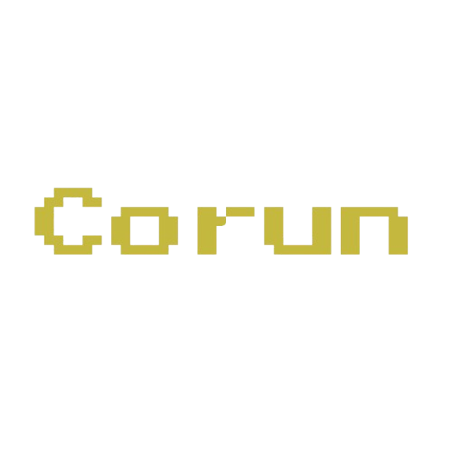
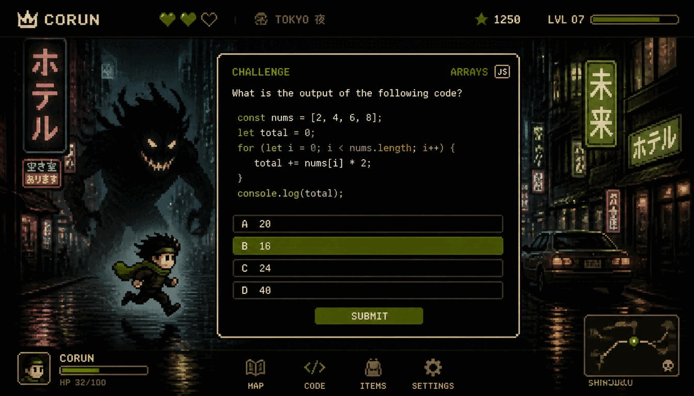
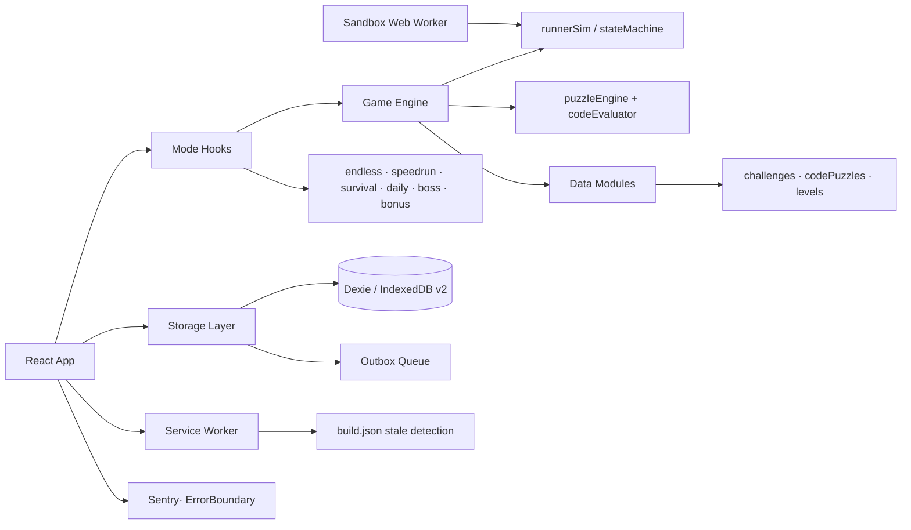

<p align="center">
  <picture>
    <source media="(prefers-color-scheme: dark)" srcset="public/icons/Corun.png">
    
  </picture>
</p>

<h1 align="center">CORUN</h1>
<h3 align="center">Escape the Monster — A 2D Pixel‑Art Coding Game</h3>

<p align="center">
  <em>Solve real JavaScript puzzles. Escape the cell. Master programming through play.</em>
</p>

<p align="center">
  <a href="https://corun-zeta.vercel.app">
    
  </a>
</p>

<p align="center">
  
</p>

<p align="center">
  <a href="https://github.com/alimaandev/corun/actions"></a>
  <a href="https://github.com/alimaandev/corun/releases"></a>
  <a href="https://github.com/alimaandev/corun/tags"></a>
  <a href="https://github.com/alimaandev/corun/blob/main/LICENSE"></a>
  <a href="https://github.com/alimaandev/corun"></a>
</p>

<br />

---

## Quick Start

```bash
git clone https://github.com/alimaandev/corun.git
cd corun
npm install
npm run dev        # → http://localhost:3000
```

No accounts needed — guest/demo mode works out of the box. All progress is stored locally in your browser.

```bash
npm run typecheck  # tsc -b
npm run lint       # eslint src/
npm run test       # vitest run (110 tests, 13 suites)
npm run build      # vite build → dist/
```

> [Play the live game →](https://corun-zeta.vercel.app)

<br />

---

## Why Corun?

Most coding games are either **multiple-choice trivia** or **dry syntax drills**. Corun is neither.

```
You are trapped in a Tokyo cell.
A monster is breaking through the wall.
The only way out is to code.
```

- **Real JavaScript** — Write and evaluate actual JS (sandboxed in a Web Worker), not pseudo-code. **52 story puzzles** plus **26 quick-fire runner challenges** across strings, arrays, objects, regex, math, logic, and ES6+.
- **Offline-first** — Reliable storage, migrations, and sync are handled on-device with **Dexie (IndexedDB) v2** and a retrying **outbox queue**. Install it as a PWA and it works with no connection.
- **Pick up where you left off** — An unfinished run is saved and resumable from the start screen for up to 2 hours.
- **Stale-proof deploys** — A `build.json` fingerprint detected at boot (and on tab focus) reloads only when a true new build appears, so you never play a half-updated bundle.
- **Procedural soundtrack** — Every level has a unique Web Audio API composition. Zero audio files. BPM scales with your progress.
- **Works everywhere** — Installable PWA, touch controls, full offline support, 3 locales (EN/ES/FR).

> _"Every line of code brought you home."_

<br />

---

## Features

<table>
  <tr>
    <td width="50%">
      <h4>🏰 <strong>2D Parallax Story Mode</strong></h4>
      <p>12 hand-crafted levels with an inline code editor, NPCs, and a Tokyo-to-escape narrative. (3D/three.js retained as main-menu ambiance.)</p>
    </td>
    <td width="50%">
      <h4>✍️ <strong>52 Real Code Puzzles</strong></h4>
      <p>Type actual JS into sandboxed editors — strings, arrays, objects, regex, math, logic, ES6+. Evaluated in a Web Worker.</p>
    </td>
  </tr>
  <tr>
    <td>
      <h4>🏃 <strong>Endless Runner (Free Play)</strong></h4>
      <p>3-lane escape with adaptive difficulty, combo multipliers up to 4×, boss battles, and 5-second bonus rounds. 26 quick-fire challenges.</p>
    </td>
    <td>
      <h4>⚡ <strong>Speed Run & Survival</strong></h4>
      <p>Speed Run = 60-second countdown, wrong answers cost points. Survival = 3 lives, harder questions as you survive.</p>
    </td>
  </tr>
  <tr>
    <td>
      <h4>🗓️ <strong>Daily Challenge</strong></h4>
      <p>One shot, one score, every day. Seeded daily pool and a daily leaderboard to compare against repeat players.</p>
    </td>
    <td>
      <h4>💾 <strong>Local-First Persistence</strong></h4>
      <p>Scores, badges, level progress, daily stats, and profile live in IndexedDB (Dexie v2). A write-ahead outbox retries queued writes with backoff.</p>
    </td>
  </tr>
  <tr>
    <td>
      <h4>🔄 <strong>Run Resume</strong></h4>
      <p>An in-progress run is snapshotted (mode, topic, difficulty, score, level) and offered as “RUN SAVED — CONTINUE” on the start screen.</p>
    </td>
    <td>
      <h4>🌐 <strong>i18n</strong></h4>
      <p>English, Spanish, French. Auto-detects browser locale, persisted to localStorage.</p>
    </td>
  </tr>
  <tr>
    <td>
      <h4>📱 <strong>PWA / Offline</strong></h4>
      <p>Installable on any device with service-worker precaching and automatic asset updates.</p>
    </td>
    <td>
      <h4>🛠️ <strong>User-Generated Puzzles</strong></h4>
      <p>Built-in puzzle editor, share via URL, browse custom challenges. Create and play your own.</p>
    </td>
  </tr>
</table>

<br />

---

## Architecture


```mermaid
flowchart LR
  UI[React App] --> Hooks[Mode Hooks]
  Hooks --> Engine[Game Engine]
  UI --> Storage[Storage Layer]
  Engine --> Sim[runnerSim / stateMachine]
  Engine --> Solve[puzzleEngine + codeEvaluator]
  Engine --> Data[Data Modules]
  Data --> Challenges[challenges · codePuzzles · levels]
  Sandbox[Sandbox Web Worker] --> Sim
  Hooks --> Modes["endless · speedrun · survival · daily · boss · bonus"]
  Storage --> Db[(Dexie / IndexedDB v2)]
  Storage --> Outbox[Outbox Queue]
  UI --> SW[Service Worker]
  SW --> BuildCheck[build.json stale detection]
  UI --> Sentry[Sentry· ErrorBoundary]
```

**Layers**

- **Engine** — `src/game/engine/` — pure, framework-free simulation (runner sim, puzzle engine, scorer, code evaluator, state machine) fully unit-tested.
- **Features** — `src/features/` — React hooks per game mode wired into the engine.
- **Storage** — `src/lib/` — `db.ts` (Dexie schema v2 + localStorage migration), `outbox.ts` (retry queue), `storage.ts` (high scores, badges, daily, sessions).
- **App** — `src/app/` — screens and routing; heavy screens are lazily code-split.

<br />

---

## Game Modes

<details>
<summary><strong>🏰 Story Mode</strong> — 12 hand-crafted 2D levels</summary>

<br />

A story-driven 2D parallax adventure. Walk through the world, talk to NPCs, and solve **52 code puzzles** at inline code editors to escape each zone.

| Level | Name            | Theme                          |
| ----- | --------------- | ------------------------------ |
| 1     | The Cell        | `if` statements, guard patrol  |
| 2     | The Dungeon     | Loops, array filtering         |
| 3     | The Sewers      | String manipulation, recursion |
| 4     | The Forest      | Object manipulation            |
| 5     | The Village     | Sorting, comparison            |
| 6     | The Bridge      | Math utilities, geometry       |
| 7     | The Courtyard   | Stack/queue, validation        |
| 8     | The Hall        | State machines                 |
| 9     | The Throne Room | Combined + final boss          |
| 10    | The Library     | Array methods, indexOf         |
| 11    | The Laboratory  | String ops, sequences          |
| 12    | The Tower Spire | Advanced logic                 |

</details>

<details>
<summary><strong>🏃 Endless Runner (Free Play)</strong> — Procedural arcade mode</summary>

<br />

Classic 3-lane escape. Quick-fire questions pop up mid-run — answer fast or the monster closes in.

- **4 question types** — Multiple choice, fill-in-blank, output prediction, spot the bug
- **Adaptive difficulty** — 3 correct = harder, 2 wrong = easier
- **Combo multiplier** — 3+ streak → 1.5× up to 4× at 10+
- **Boss battles** — Every ~150 pts, hard questions, big rewards
- **Bonus rounds** — Every ~80 pts, 5-second lightning round, 2× points
- **Mastery badges** — Topic mastery tracked across runs

</details>

<details>
<summary><strong>⚡ Speed Run & ❤️ Survival</strong> — Competitive variants</summary>

<br />

| Mode          | Rules                                                                  |
| ------------- | ---------------------------------------------------------------------- |
| **Speed Run** | 60-second countdown. Wrong answers cost points. Timer in HUD.          |
| **Survival**  | 3 lives. Every wrong answer loses one. Hearts in HUD. Steadily harder. |

</details>

<details>
<summary><strong>🗓️ Daily Challenge</strong> — One shot per day</summary>

<br />

A seeded, fixed question pool for the day. One score per day, globally ranked on the daily leaderboard. Progress and history persist across visits.

</details>

<br />

---

## Storing Data — Offline-First, No Backend

Corun is deliberately **local-first**: no auth vendor, no external database.

- **Dexie v2 (IndexedDB)** — profiles, scores, badges, daily runs, level progress, settings, outbox.
- **Migration** — a v1→v2 upgrade path migrates legacy `localStorage` data into the new schema automatically.
- **Outbox** — writes are enqueued, flushed with exponential backoff (max 5 attempts), and retried on the next boot. Nothing is lost when you're offline.
- **Sessions** — unfinished runs are snapshotted and offered on the start screen (2-hour TTL).

Leaderboard entries are computed from local `scores` and shaped for a future remote sync through the same outbox pipeline.

<br />

---

## Releases & Tags

Releases are **fully automated** with [semantic-release](https://github.com/semantic-release/semantic-release) in `.github/workflows/release.yml` — a push to `main` with `feat`/`fix` commits bumps the version, writes the changelog, and tags a GitHub release. The **latest** release is always downloadable from the [Releases page](https://github.com/alimaandev/corun/releases).

| Tag        | Date       | Highlights                                                                                |
| ---------- | ---------- | ----------------------------------------------------------------------------------------- |
| **v1.6.0** | 2026-08-04 | 2D parallax story levels, Dexie v2 migration + outbox, engine extraction, resume last run |
| v1.5.x     | 2026-07-30 | Session persistence groundwork, scheduling/badges refinement (3 patch releases)           |
| v1.4.0     | 2026-07-30 | Daily challenge + leaderboards                                                            |
| v1.3.0     | 2026-07-27 | Competitive modes (Speed Run / Survival)                                                  |
| v1.2.0     | 2026-07-26 | PWA install + service worker caching                                                      |
| v1.1.x     | 2026-07-26 | UX/i18n polish                                                                            |
| v1.0.0     | 2026-07-23 | Initial production release                                                                |

<details>
<summary><strong>All tags / changelog</strong></summary>

```bash
git tag -l --sort=-version:refname
```

`v1.0.0` · `v1.1.0` · `v1.1.1` · `v1.2.0` · `v1.3.0` · `v1.4.0` · `v1.5.0` · `v1.5.1` · `v1.5.2` · `v1.6.0`

</details>

<br />

---

## Tech Stack

| Category       | Tools                                                                                                 |
| -------------- | ----------------------------------------------------------------------------------------------------- |
| **Frontend**   | React 18, TypeScript, Vite 6, Three.js + @react-three/fiber (menu ambiance), Canvas 2D (story levels) |
| **Storage**    | Dexie 4 (IndexedDB v2), localStorage, outbox queue                                                    |
| **Audio**      | Web Audio API (procedural synthesis, zero audio files)                                                |
| **Testing**    | Vitest, React Testing Library, fake-indexeddb, jsdom — **110 tests / 13 suites**                      |
| **CI/CD**      | GitHub Actions (CI, semantic-release, PR title/label, stale)                                          |
| **PWA**        | vite-plugin-pwa, Workbox, service-worker precaching, build.json update check                          |
| **Monitoring** | Sentry (opt-in via `VITE_SENTRY_DSN`)                                                                 |
| **Deploy**     | Vercel (`corun` project → <https://corun-zeta.vercel.app>)                                            |

<br />

---

## Development Workflow

```bash
npm install        # install
npm run dev        # dev server on :3000
npm run typecheck  # strict TS
npm run lint       # ESLint + Prettier (git-staged on commit)
npm run test       # unit tests
npm run test:watch # watch mode
npm run build      # production build → dist/
```

Merged PRs to `main` automatically:

1. **Deploy** → Vercel builds the push and promotes it to production.
2. **Release** → semantic-release evaluates commits; `feat`/`fix` produces a new tag + GitHub release.

<br />

---

## Star History

<p align="center">
  <a href="https://star-history.com/#alimaandev/corun&Date">
    
  </a>
</p>

<p align="center">
  <a href="https://github.com/alimaandev/corun">
    
  </a>
  <a href="https://twitter.com/intent/tweet?text=🏃%20CORUN%20-%20Escape%20the%20Monster%20-%20A%20pixel-art%20coding%20game.%20Solve%20JavaScript%20puzzles.%20Escape%20the%20monster.%20&url=https://github.com/alimaandev/corun">
    
  </a>
  <a href="https://news.ycombinator.com/submitlink?u=https://github.com/alimaandev/corun&t=CORUN%20-%20Escape%20the%20Monster">
    
  </a>
</p>

<br />

---

## Contributing

All contributions welcome — bug fixes, features, translations, docs.

- [Bug reports](https://github.com/alimaandev/corun/issues/new?labels=bug&template=bug_report.yml)
- [Feature requests](https://github.com/alimaandev/corun/issues/new?labels=enhancement&template=feature_request.yml)
- [Good first issues](https://github.com/alimaandev/corun/labels/good%20first%20issue)
- [Contributing guide](CONTRIBUTING.md)

> PR titles must follow [Conventional Commits](https://www.conventionalcommits.org/) — they drive the automated releases.

<br />

---

## License

MIT © [Ali Sher](https://github.com/alimaandev)

<p align="center">
  <sub><em>"Every line of code brought you home."</em></sub>
  <br />
  <sub>Built with React · TypeScript · Dexie · Vite</sub>
</p>
